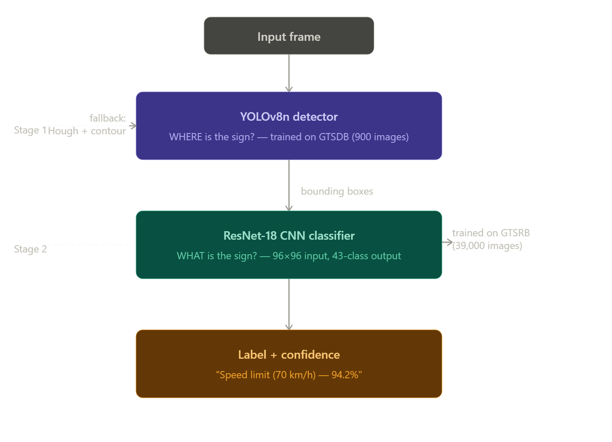

<div align="center">

<br>

# ⬡ &nbsp; TRAFFICSENSE

**Neural Traffic Sign Detection & Classification**

<br>


<br>

YOLOv8n finds every sign in the frame. ResNet-18 names it.<br>
Drop any image or video into the web interface — annotated results in seconds, no manual cropping needed.

<br>

</div>

---

## Architecture

<div align="center">

</div>

<br>

> [!TIP]
> YOLO handles real-world detection — small, distant, and partially occluded signs.
> ResNet-18 does fine-grained 43-class classification using the much richer GTSRB dataset.
> Neither model alone achieves what the two-stage pipeline does together.

---

## Features

| | |
|---|---|
| **Web Interface** | Drop an image or video, get annotated results in seconds |
| **Live Progress** | Upload %, frame counter, and ETA during video processing |
| **Temporal Tracker** | IoU-based tracker prevents label flickering between frames |
| **Auto Frame-Skip** | Scales with video length (3–8 frames) to stay fast |
| **Fallback Detector** | Hough + contour detection when YOLO weights are unavailable |
| **43-class GTSRB** | All German traffic sign classes with human-readable names |
| **Real-world Augmentation** | Perspective warp, motion blur, fog simulation, colour jitter, random erasing |
| **Mixed Precision** | AMP + OneCycleLR + progressive backbone unfreezing |

---

## Quick Start

```bash
# Install dependencies
pip install -r requirements.txt
pip install ultralytics flask

# Launch the web interface (after training — see below)
cd traffic_sign_cnn
python app.py
```

Open **http://localhost:5000**, drop a file, done.

---

## Training

### Step 1 — CNN Classifier

Download the [GTSRB dataset](https://benchmark.ini.rub.de/gtsrb_dataset.html) and place the 43 class subfolders inside `data/dataset/`, then:

```bash
cd traffic_sign_cnn
python train.py
```

Output: `models/best_model.pth`

Key techniques: ResNet-18 pretrained backbone · progressive unfreezing at epoch 5 · OneCycleLR · AMP · label smoothing 0.1

---

### Step 2 — Prepare GTSDB for YOLO

Download `FullIJCNN2013.zip` from [benchmark.ini.rub.de](https://benchmark.ini.rub.de/gtsdb_dataset.html) and extract to `data/gtsdb/`, then:

```bash
python prepare_gtsdb.py
```

---

### Step 3 — YOLO Detector

```bash
python train_yolo.py --device 0      # GPU
python train_yolo.py --device cpu    # CPU
```

**GTSDB validation results:**

| Metric | Score |
|---|---|
| mAP @ 0.5 | **97.1%** |
| mAP @ 0.5:0.95 | **77.1%** |
| Precision | **97.8%** |
| Recall | **89.3%** |

Output: `models/yolo_detector.pt`

---

## Web Interface

```bash
cd traffic_sign_cnn
python app.py
# → http://localhost:5000
```

- **Images** — annotated result returned in ~1 second
- **Videos** — async processing with live progress bar, frame counter, and ETA
- **Confidence slider** — tune detection sensitivity on the fly
- **Download** — export the annotated result with the ↓ button

> [!NOTE]
> The server auto-detects `yolo_detector.pt` at startup and uses it if present.
> If the file is missing it silently falls back to Hough + contour detection.

---

## CLI

```bash
# Image
python detect_predict.py --input image.jpg

# Video with custom confidence threshold
python detect_predict.py --input drive.mp4 --conf 60
```

---

## Configuration

All hyperparameters live in `traffic_sign_cnn/config.py`:

| Parameter | Default | Description |
|---|---|---|
| `IMG_SIZE` | `96` | CNN input resolution (px) |
| `USE_PRETRAINED_RESNET` | `True` | ResNet-18 ImageNet backbone |
| `LEARNING_RATE` | `3e-4` | AdamW learning rate |
| `LABEL_SMOOTHING` | `0.1` | Cross-entropy smoothing factor |
| `UNFREEZE_EPOCH` | `5` | Epoch at which backbone unfreezes |
| `ROI_Y_MIN / ROI_Y_MAX` | `0.05 / 0.80` | Vertical detection band (skip sky + road) |
| `YOLO_CONF_THRESHOLD` | `0.35` | Minimum YOLO box confidence |

---

## Project Structure

```
traffic_sign_cnn/
├── app.py                  ← Flask web server  (start here)
├── roi_interface.html      ← web UI
├── train.py                ← CNN training loop
├── train_yolo.py           ← YOLOv8n detector training
├── detect_predict.py       ← detection + classification pipeline
├── prepare_gtsdb.py        ← convert GTSDB → YOLO format
├── evaluate.py             ← evaluation + confusion matrix
├── predict.py              ← standalone CLI inference
├── config.py               ← hyperparameters and class mappings
├── models/
│   ├── cnn_model.py        ← ResNet-18 + custom CNN architectures
│   ├── best_model.pth      ← trained CNN weights  (not in git — train locally)
│   └── yolo_detector.pt    ← trained YOLO weights (not in git — train locally)
├── utils/
│   ├── dataset_loader.py   ← Dataset + augmentation pipeline
│   ├── visualize.py        ← training curves, confusion matrix
│   └── extract_frames.py   ← video → JPEG frames
└── data/
    ├── dataset/            ← GTSRB training data (not in git)
    ├── gtsdb/              ← GTSDB detection data (not in git)
    └── gtsdb_yolo/         ← converted YOLO format (auto-generated)
```
